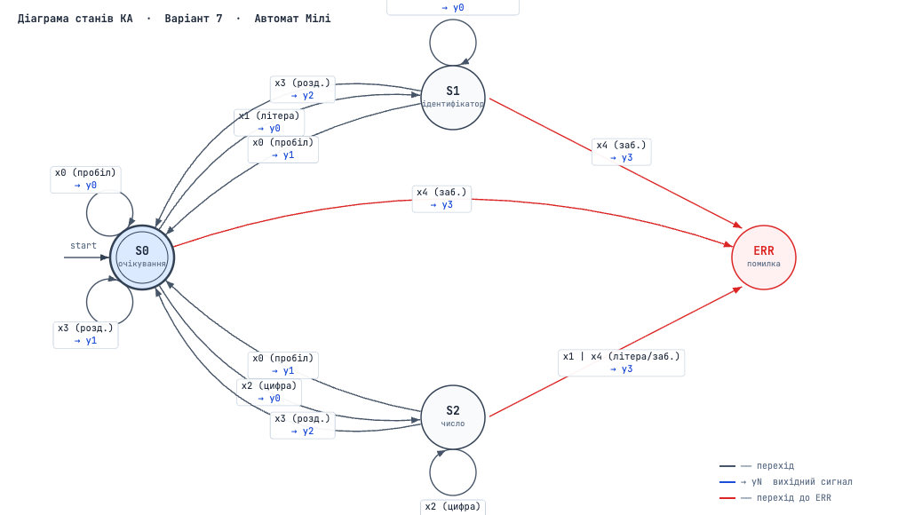

# ЛАБОРАТОРНА РОБОТА № 1
## Побудова лексичного аналізатора на основі скінченного автомата

**Студент:** Борисов Ілля  
**Група:** КН-Н921  
**Варіант:** 7  

---

## 1. Постановка задачі

Побудувати модель лексичного аналізатора на основі скінченного автомата для виділення лексем виразу, що містить конструкції мови програмування з ключовими словами `if` та `else`, ідентифікаторами, числами та роздільниками `( ) { } ;`.

**Приклади вхідних рядків:**

```
if ( expr ) { stmt1; };

if ( expr ) { stmt; } else { stmt; stmt; stmt; };

if ( expr ) { stmt; stmt; } else if ( expr ) { stmt; stmt; } else { stmt; stmt; stmt; };
```

---

## 2. Визначення множин автомата

### 2.1 Множина вхідних символів X

| Позначення | Опис |
|------------|------|
| `x0` | Пробіл, табуляція, перенос рядка (`' '`, `\t`, `\n`, `\r`) |
| `x1` | Літера або символ підкреслення (`[a-zA-Z_]`) |
| `x2` | Цифра (`[0-9]`) |
| `x3` | Роздільник: `(`, `)`, `{`, `}`, `;` |
| `x4` | Заборонений символ |

**X = { x0, x1, x2, x3, x4 }**

### 2.2 Множина внутрішніх станів S

| Позначення | Опис |
|------------|------|
| `S0` | Початковий стан - очікування наступної лексеми |
| `S1` | Зчитування ідентифікатора або ключового слова |
| `S2` | Зчитування числа |
| `S_ERR` | Стан помилки |

**S = { S0, S1, S2, S_ERR }**

### 2.3 Множина вихідних символів Y

| Позначення | Опис |
|------------|------|
| `y0` | Лексема не виділена (накопичення) |
| `y1` | Виділена одна лексема |
| `y2` | Виділено дві лексеми (лексема + роздільник) |
| `y3` | Помилка зчитування |

**Y = { y0, y1, y2, y3 }**

---

## 3. Таблиця переходів абстрактного автомата

| Внутрішній стан | x0 (пробіл) | x1 (літера) | x2 (цифра) | x3 (розд.) | x4 (заб.) |
|-----------------|-------------|-------------|------------|------------|-----------|
| **S0** | S0 / y0 | S1 / y0 | S2 / y0 | S0 / y1 | S_ERR / y3 |
| **S1** | S0 / y1 | S1 / y0 | S1 / y0 | S0 / y2 | S_ERR / y3 |
| **S2** | S0 / y1 | S_ERR / y3 | S2 / y0 | S0 / y2 | S_ERR / y3 |

**Таблиця 1 - Таблиця переходів КА (варіант 7)**

---

## 4. Діаграма станів (граф-схема переходів)



**Рисунок 1 - Граф-схема переходів автомата Мілі (варіант 7)**

---

## 5. Тип автомата

Побудований автомат є **автоматом Мілі**, оскільки вихідний сигнал `y` залежить одночасно від **поточного внутрішнього стану** і **вхідного символу** (функція виходу виду `ω(S, x)`), а не лише від стану.

---

## 6. Перевірка роботи автомата на прикладах

### Приклад 1: `if ( expr ) { stmt1; };`

| Крок | Символ | Клас | Стан до | Стан після | Вихід | Лексема |
|------|--------|------|---------|------------|-------|---------|
| 1 | `i` | x1 | S0 | S1 | y0 | - |
| 2 | `f` | x1 | S1 | S1 | y0 | - |
| 3 | ` ` | x0 | S1 | S0 | y1 | `if` → KEYWORD |
| 4 | `(` | x3 | S0 | S0 | y1 | `(` → DELIMITER |
| 5 | ` ` | x0 | S0 | S0 | y0 | - |
| 6–9 | `expr` | x1 | S0→S1 | S1 | y0 | - |
| 10 | ` ` | x0 | S1 | S0 | y1 | `expr` → IDENTIFIER |
| 11 | `)` | x3 | S0 | S0 | y1 | `)` → DELIMITER |
| 12 | ` ` | x0 | S0 | S0 | y0 | - |
| 13 | `{` | x3 | S0 | S0 | y1 | `{` → DELIMITER |
| 14–18 | `stmt1` | x1 | S0→S1 | S1 | y0 | - |
| 19 | `;` | x3 | S1 | S0 | y2 | `stmt1` → IDENTIFIER + `;` → DELIMITER |
| 20 | `}` | x3 | S0 | S0 | y1 | `}` → DELIMITER |
| 21 | `;` | x3 | S0 | S0 | y1 | `;` → DELIMITER |

**Результат:** `KEYWORD(if)`, `DELIMITER(()`, `IDENTIFIER(expr)`, `DELIMITER())`, `DELIMITER({)`, `IDENTIFIER(stmt1)`, `DELIMITER(;)`, `DELIMITER(})`, `DELIMITER(;)`

### Приклад 2: Рядок з помилкою `if 123abc`

| Крок | Символ | Клас | Стан до | Стан після | Вихід |
|------|--------|------|---------|------------|-------|
| 1–2 | `if` | x1 | S0→S1 | S1 | y0 |
| 3 | ` ` | x0 | S1 | S0 | y1 - `if` |
| 4–6 | `123` | x2 | S0→S2 | S2 | y0 |
| 7 | `a` | x1 | S2 | S_ERR | y3 - **ПОМИЛКА** |

---

## 7. Програмна модель автомата (JavaScript)

```javascript
// Recognized keywords set
const KEYWORDS = new Set(['if', 'else']);

// Recognized delimiter characters
const DELIMITERS = new Set(['(', ')', '{', '}', ';']);

/**
 * Finite automaton transition table.
 * transitionTable[currentState][charClass] = nextState
 */
const transitionTable = {
    S0: { space: 'S0', letter: 'S1', digit: 'S2', delim: 'S0',    other: 'S_ERR' },
    S1: { space: 'S0', letter: 'S1', digit: 'S1', delim: 'S0',    other: 'S_ERR' },
    S2: { space: 'S0', letter: 'S_ERR', digit: 'S2', delim: 'S0', other: 'S_ERR' },
};

/**
 * Determines the character class for the automaton transition table.
 * @param {string} ch - single character
 * @returns {'space'|'letter'|'digit'|'delim'|'other'}
 */
function getCharClass(ch) {
    if (' \t\n\r'.includes(ch))  return 'space';
    if (/[a-zA-Z_]/.test(ch))   return 'letter';
    if (/[0-9]/.test(ch))       return 'digit';
    if (DELIMITERS.has(ch))     return 'delim';
    return 'other';
}

/**
 * Lexical scanner based on a finite automaton (Mealy machine).
 * Recognizes: KEYWORD, IDENTIFIER, NUMBER, DELIMITER, ERROR tokens.
 * @param {string} source - input source string
 * @returns {Array<{type: string, value: string, pos?: number}>}
 */
function scanner(source) {
    const chars  = Array.from(source);
    const tokens = [];
    let state    = 'S0';
    let lexeme   = [];

    // Flush accumulated letters/underscores as KEYWORD or IDENTIFIER
    function flushWord() {
        if (lexeme.length === 0) return;
        const word = lexeme.join('');
        tokens.push(
            KEYWORDS.has(word)
                ? { type: 'KEYWORD',    value: word }
                : { type: 'IDENTIFIER', value: word }
        );
        lexeme = [];
    }

    // Flush accumulated digits as NUMBER
    function flushNum() {
        if (lexeme.length === 0) return;
        tokens.push({ type: 'NUMBER', value: lexeme.join('') });
        lexeme = [];
    }

    for (let i = 0; i < chars.length; i++) {
        const cls       = getCharClass(chars[i]);
        const nextState = transitionTable[state]?.[cls] ?? 'S_ERR';

        // On error - record error token and stop processing
        if (nextState === 'S_ERR') {
            tokens.push({ type: 'ERROR', value: chars[i], pos: i });
            return tokens;
        }

        if (state === 'S0') {
            // Accumulate first character of a new word or number
            if (cls === 'letter' || cls === 'digit') {
                lexeme.push(chars[i]);
            } else if (cls === 'delim') {
                tokens.push({ type: 'DELIMITER', value: chars[i] });
            }
            // Spaces in S0 are silently skipped
        } else if (state === 'S1') {
            if (cls === 'letter' || cls === 'digit') {
                // Continue accumulating identifier characters
                lexeme.push(chars[i]);
            } else if (cls === 'space') {
                flushWord();
            } else if (cls === 'delim') {
                // Identifier ended, delimiter is a separate token
                flushWord();
                tokens.push({ type: 'DELIMITER', value: chars[i] });
            }
        } else if (state === 'S2') {
            if (cls === 'digit') {
                // Continue accumulating number digits
                lexeme.push(chars[i]);
            } else if (cls === 'space') {
                flushNum();
            } else if (cls === 'delim') {
                // Number ended, delimiter is a separate token
                flushNum();
                tokens.push({ type: 'DELIMITER', value: chars[i] });
            }
        }

        state = nextState;
    }

    // Flush any remaining lexeme if source ended without a delimiter
    flushWord();
    flushNum();

    return tokens;
}

// --- Test cases ---

const source  = `if ( expr ){ stmt1; };`;
const source1 = `if ( expr ){ stmt; } else { stmt; stmt; stmt; };`;
const source2 = `if ( expr ){ stmt; stmt; } else if ( expr ){ stmt; stmt; } else { stmt; stmt; stmt; };`;

console.log('=== Рядок 1 ===');
console.table(scanner(source));

console.log('=== Рядок 2 ===');
console.table(scanner(source1));

console.log('=== Рядок 3 ===');
console.table(scanner(source2));
```

---

## 8. Результати роботи програми

**Вивід для рядка 1** (`if ( expr ){ stmt1; };`):

| type | value |
|------|-------|
| KEYWORD | if |
| DELIMITER | ( |
| IDENTIFIER | expr |
| DELIMITER | ) |
| DELIMITER | { |
| IDENTIFIER | stmt1 |
| DELIMITER | ; |
| DELIMITER | } |
| DELIMITER | ; |

**Вивід для рядка 2** (`if ( expr ){ stmt; } else { stmt; stmt; stmt; };`):

| type | value |
|------|-------|
| KEYWORD | if |
| DELIMITER | ( |
| IDENTIFIER | expr |
| DELIMITER | ) |
| DELIMITER | { |
| IDENTIFIER | stmt |
| DELIMITER | ; |
| DELIMITER | } |
| KEYWORD | else |
| DELIMITER | { |
| IDENTIFIER | stmt |
| DELIMITER | ; |
| IDENTIFIER | stmt |
| DELIMITER | ; |
| IDENTIFIER | stmt |
| DELIMITER | ; |
| DELIMITER | } |
| DELIMITER | ; |

**Вивід для рядка 3** (`if...else if...else`):

| type | value |
|------|-------|
| KEYWORD | if |
| DELIMITER | ( |
| IDENTIFIER | expr |
| DELIMITER | ) |
| DELIMITER | { |
| IDENTIFIER | stmt |
| DELIMITER | ; |
| IDENTIFIER | stmt |
| DELIMITER | ; |
| DELIMITER | } |
| KEYWORD | else |
| KEYWORD | if |
| DELIMITER | ( |
| IDENTIFIER | expr |
| DELIMITER | ) |
| DELIMITER | { |
| ... | ... |
| DELIMITER | ; |

---

## 9. Таблиця символів

| № | Ім'я / Значення | Тип | Атрибут |
|---|-----------------|-----|---------|
| 1 | `if` | KEYWORD | - |
| 2 | `else` | KEYWORD | - |
| 3 | `expr` | IDENTIFIER | змінна |
| 4 | `stmt` | IDENTIFIER | оператор |
| 5 | `stmt1` | IDENTIFIER | оператор |
| 6 | `(` | DELIMITER | - |
| 7 | `)` | DELIMITER | - |
| 8 | `{` | DELIMITER | - |
| 9 | `}` | DELIMITER | - |
| 10 | `;` | DELIMITER | - |

---

## 10. Висновки

У ході виконання лабораторної роботи:

1. Визначено множини вхідних символів **X = { x0, x1, x2, x3, x4 }**, внутрішніх станів **S = { S0, S1, S2, S_ERR }** та вихідних символів **Y = { y0, y1, y2, y3 }**.

2. Побудовано таблицю переходів абстрактного КА для лексичного аналізатора, що розпізнає ключові слова `if`/`else`, ідентифікатори, числа та роздільники.

3. Встановлено, що побудований автомат є **автоматом Мілі**, оскільки вихідний сигнал визначається парою (поточний стан, вхідний символ).

4. Розроблено програмну модель сканера мовою **JavaScript**, яка реалізує таблицю переходів КА і формує послідовність токенів з визначенням їх типів: `KEYWORD`, `IDENTIFIER`, `NUMBER`, `DELIMITER`, `ERROR`.

5. Перевірено роботу програмної моделі на трьох тестових прикладах - всі коректні лексеми розпізнано правильно, а некоректні символи призводять до виводу токена `ERROR`.

---

## Список використаних джерел

1. Ахо А., Лам М., Сеті Р., Ульман Дж. Компілятори: принципи, техніки та засоби. - 2-е вид. - М.: Вільямс, 2008.
2. Марченко О.І., Марченко О.О. Теорія формальних мов та синтаксичного аналізу. - КПІ, 2020.
3. Лексичний аналіз // Вікіпедія [Електронний ресурс]. - URL: https://uk.wikipedia.org/wiki/Лексичний_аналіз